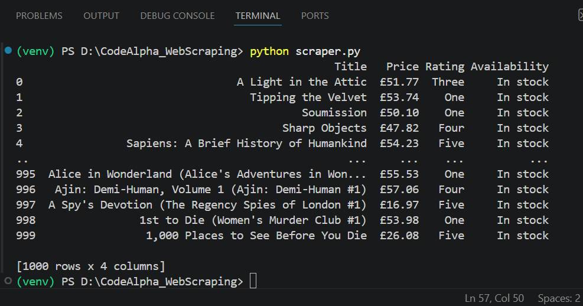
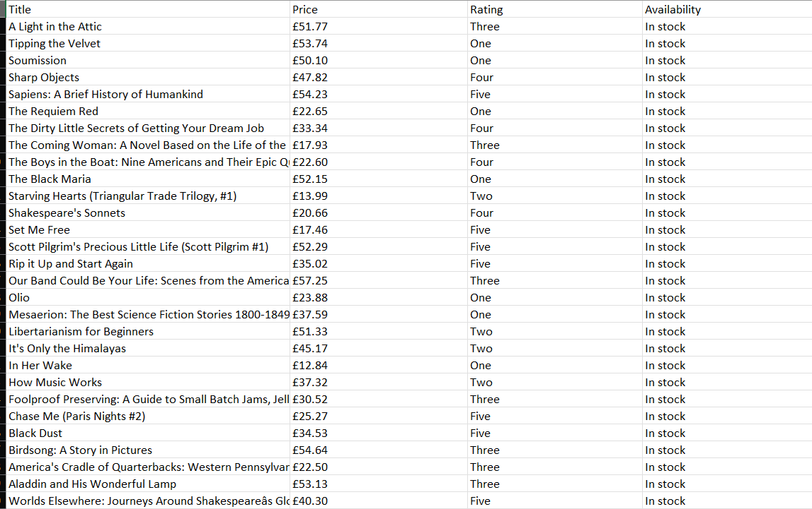

# 📚 Book Store Web Scraper

A Python web scraping project developed as part of the **CodeAlpha Python Programming Internship**.

---

## 📌 Project Overview

This project scrapes book information from the **Books to Scrape** website (http://books.toscrape.com/) using Python. It automatically navigates through all **50 pages**, extracts details of **1000 books**, and stores the collected data in a CSV file for further analysis.

---

## 🚀 Features

- Scrapes all 50 pages of the website
- Collects information for 1000 books
- Extracts the following details:
  - 📖 Title
  - 💷 Price
  - ⭐ Rating
  - 📦 Availability
- Stores the extracted data in a Pandas DataFrame
- Exports the dataset to a CSV file
- Implements automatic pagination

---

## 🛠️ Technologies Used

- Python
- Requests
- BeautifulSoup4
- Pandas
- lxml

---

## 📂 Project Structure

```text
CodeAlpha_WebScraping/
│
├── output/
│   └── books.csv
│
├── screenshots/
│   ├── terminal_output.png
│   └── excel_output.png
│
├── scraper.py
├── requirements.txt
├── README.md
└── .gitignore
```

---

## ⚙️ Installation

### 1. Clone the repository

```bash
git clone https://github.com/Ayansanyal6302/CodeAlpha_WebScraping.git
```

### 2. Navigate to the project folder

```bash
cd CodeAlpha_WebScraping
```

### 3. Install the required libraries

```bash
pip install -r requirements.txt
```

### 4. Run the scraper

```bash
python scraper.py
```

---

## 📊 Output

The scraper successfully extracts information from **1000 books** across **50 pages** and stores the dataset in:

```text
output/books.csv
```

The exported dataset contains the following columns:

| Title | Price | Rating | Availability |
|-------|-------|--------|--------------|
| A Light in the Attic | £51.77 | Three | In stock |
| Tipping the Velvet | £53.74 | One | In stock |
| ... | ... | ... | ... |

---

## 📸 Screenshots

### 💻 Terminal Output



### 📊 CSV Output



---

## 🎯 Learning Outcomes

Through this project, I learned:

- Sending HTTP requests using the Requests library
- Parsing HTML using BeautifulSoup
- Extracting data using HTML tags, classes, and attributes
- Implementing pagination for multi-page web scraping
- Working with nested loops
- Organizing data using Python dictionaries and lists
- Creating Pandas DataFrames
- Exporting datasets to CSV files
- Managing a project using Git and GitHub

---

## 📄 License

This project was created for educational purposes as part of the **CodeAlpha Python Programming Internship**.

---

## 👨‍💻 Author

**Ayan Sanyal**

Aspiring Data Analyst

Developed as part of the **CodeAlpha Python Programming Internship**.